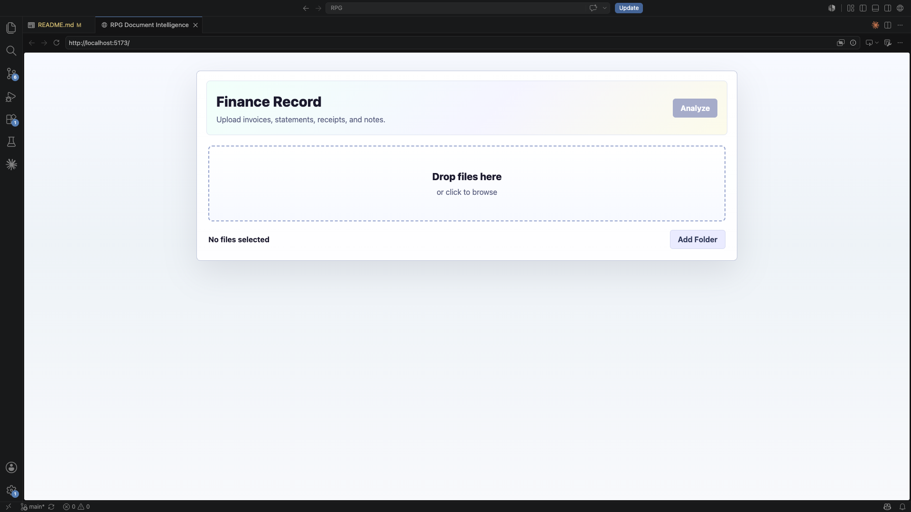
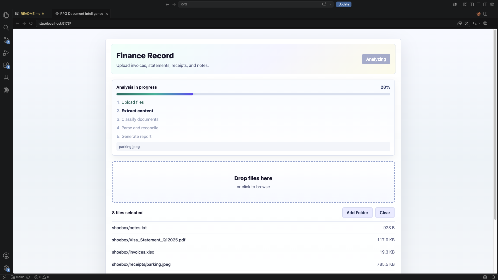
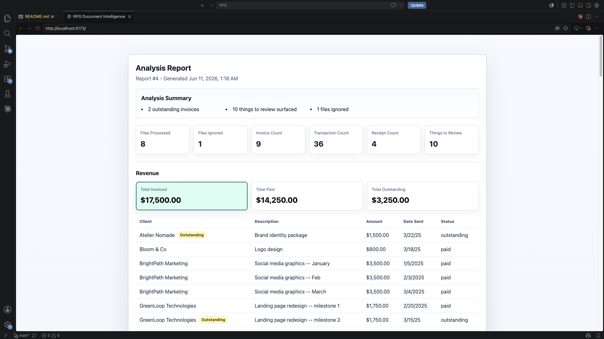
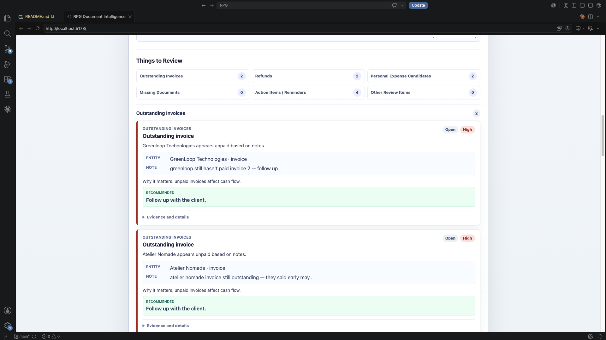

<h1 align="center">Finance Record</h1>

<p align="center">
  A local-first document intelligence app for  small-business records.
</p>

<p align="center">
  <strong>Upload invoices, statements, receipts, and notes.</strong><br />
  Finance Record extracts the useful details, reconciles them with note context,
  and turns the result into a readable business report.
</p>

<p align="center">
  
  
  
  
  
  
</p>


## Stack

| Layer | Used |
| --- | --- |
| Frontend | React 19 + Vite |
| Backend API | FastAPI + Uvicorn |
| Persistence | SQLite + SQLAlchemy |
| Uploads | FastAPI multipart file upload |
| Extraction | Local parsers for text, CSV, HTML, spreadsheets, PDFs, and images |
| OCR | PaddleOCR and local OCR fallback pipeline |
| Local LLM / VLM | Qwen2.5-VL through local Transformers tooling |
| Reconciliation | Deterministic matching, review-item generation, frontend presentation mapping |

Finance Record is designed to run locally. It does not require cloud APIs.
The LLM/VLM path is used for informal notes and difficult OCR fallback cases;
invoices, statements, and receipts stay deterministic wherever possible.

No external API keys or sign-ups are required. Clone the project, install the
dependencies, run the backend and frontend, then upload the sample files to
evaluate the workflow. The local Qwen2.5-VL model is loaded through Transformers;
on a fresh machine, model weights may be downloaded automatically the first time
the LLM/VLM path is used. That first run can be slow because the local model must
be downloaded and loaded into memory; later runs are faster once the model is
cached.

## How to Run

Run these commands from the project root.

### Backend

```bash
python3.11 -m venv .venv
source .venv/bin/activate
python -m pip install --upgrade pip
pip install -r requirements.txt
PYTHONPATH=src uvicorn api.main:app --reload
```

If `python3.11` is not available:

```bash
python3 -m venv .venv
source .venv/bin/activate
python -m pip install --upgrade pip
pip install -r requirements.txt
PYTHONPATH=src uvicorn api.main:app --reload
```

Backend URL:

```text
http://127.0.0.1:8000
```

### Frontend

```bash
cd frontend
npm install
npm run dev
```

Frontend URL:

```text
http://127.0.0.1:5173
```

SQLite runtime data is written to:

```text
data/rpg_reports.sqlite3
```

### Run an analysis

Open the frontend in your browser, upload the sample `data/shoebox/` files or
select files individually, and wait for the report page to load.

The sample folder contains invoices, a statement, receipts, and notes used by
the pipeline, but uploads do not have to come from that folder.

## Optional CLI Run

You can also run the pipeline directly against the sample folder:

```bash
source .venv/bin/activate
PYTHONPATH=src python src/main.py
```

The CLI analyzes `data/shoebox/` and prints the generated report JSON.

## Project Layout

```text
Finance Record/
├── data/
│   └── shoebox/                  Sample invoices, statements, receipts, and notes
│       └── receipts/
├── docs/                         Challenge PDF and output schema
├── frontend/                     React/Vite frontend
│   └── src/
│       ├── components/           Shared table/card/list components
│       ├── pages/                Upload and report screens
│       └── services/             API client helpers
├── scripts/                      Manual local LLM smoke checks
└── src/
    ├── api/                      FastAPI app and route modules
    │   └── routes/
    ├── classification/           Document semantic classification
    │   └── strategies/
    ├── core/                     Shared config, enums, models, and utilities
    │   ├── config/
    │   ├── enums/
    │   ├── models/
    │   └── utils/
    ├── ingestion/                File discovery, extraction, and OCR
    │   ├── discovery/
    │   ├── extractors/
    │   └── ocr/
    ├── knowledge/                Note-derived knowledge objects and store
    ├── llm/                      Local LLM/VLM client adapters
    ├── parsing/                  Invoice, statement, receipt, and note parsers
    ├── persistence/              SQLite setup and repositories
    │   └── repositories/
    ├── reconciliation/           Entity linking and review-item generation
    ├── reporting/                Final report assembly
    ├── services/                 Analysis orchestration and progress state
    └── tests/                    Backend unit tests
```

## Architecture

### Design Goals

The challenge involves heterogeneous and partially unstructured business
records. A single upload may contain:

- invoices
- bank statements
- receipts
- handwritten images
- spreadsheets
- free-form notes
- unrelated files and noise

The system therefore needs to:

- process multiple file formats
- separate business documents from irrelevant files
- extract structured financial information
- incorporate context provided by notes
- reconcile information across documents
- produce a business-friendly report

To satisfy these requirements, Finance Record is implemented as a staged
processing pipeline. Each stage has a single responsibility and produces outputs
consumed by later stages.

### Pipeline Overview

```text
Upload
  -> Discovery
  -> Content Extraction / OCR
  -> Classification
  -> Note Understanding
  -> Knowledge Extraction
  -> Business Parsing
  -> Reconciliation
  -> Review Item Generation
  -> Report Generation
  -> Persistence
  -> Frontend Dashboard
```

## Processing Nodes

### Discovery

The discovery node is the first stage of the analysis pipeline. It receives the
uploaded workspace and scans it recursively to find every file included in the
submission.

Its responsibilities are:

- discover files inside nested folders
- identify each file's physical format, such as PDF, image, spreadsheet, text, or unknown
- create the initial file context used by later pipeline stages
- ignore temporary files and unsupported artifacts


> **Note**
>
> Finance Record intentionally separates **format understanding** from
> **business type understanding**.
>
> For example, a PDF may be an invoice, a statement, a receipt, or an unrelated
> document. The system first determines how to read the file, then determines
> what the file represents.

### Content Extraction

The content extraction node turns discovered files into readable content that
later stages can classify and parse.


Extraction strategy by format:

- **PDF:** read embedded text directly so statements, invoices, and PDF receipts
  can be classified and parsed later.
- **Image:** run OCR with a priority-and-fallback strategy. Tesseract is tried
  first because it is lightweight. If the result is weak and the image appears
  document-like, the VLM extractor is tried. PaddleOCR is then used as the
  stronger OCR fallback. If no result passes the quality checks, the best OCR
  attempt is kept and document-like output is marked for review.
- **Spreadsheet:** read workbook sheets into text previews and structured table
  rows so invoice-like spreadsheets can be parsed.
- **CSV:** read delimited rows as both text and table-like data.
- **Text:** read plain text directly, mainly for notes and lightweight records.
- **HTML:** strip markup into readable text when HTML files are included.
- **Unknown or unsupported:** preserve the file context but avoid content
  extraction, allowing later stages to ignore it safely.

This stage focuses on making each file machine-readable. For example, it may
extract receipt text from an image or transaction text from a PDF statement, but
it does not decide whether that content is business-relevant yet.

> **Note**
>
> One of the main challenges was converting image documents into reliable text.
> The first version used OCR only. That worked for regular printed receipts, but
> it was not reliable enough for handwritten or visually messy documents.
> To improve this, Finance Record adds a VLM fallback. The extraction flow starts
> with the lightest option first, then falls back to VLM when the OCR result is
> weak and the image appears to be document-like.
> This fallback strategy is meant to balance quality and simplicity: use simple,
> fast extraction when it is good enough, and only use heavier vision-language
> processing when the lighter path fails.

### Classification

The classification node determines the business meaning of a readable document.

**Supported document types**

`invoice` · `statement` · `receipt` · `note` · `unknown`

Classification is strategy-based, allowing new document types to be added
independently.

**What this node does**

- run each business classification strategy against the extracted content
- keep classification explainable by storing a score and reason for each decision
- mark files as unknown when no strategy has enough evidence
- prevent unrelated or noisy files from entering the business parsing flow

> **Note**
>
> Discovery identifies how to read a file. Classification identifies what the
> file means in the business workflow.

**Classification strategies**

| Type | Signals used |
| --- | --- |
| `invoice` | Invoice keywords, invoice-like spreadsheet headers, invoice sheet names, client/date/status fields, amount-like rows, and invoice dates. |
| `statement` | Statement anchors, account holder details, card/account signals, transaction-like lines, and repeated amount values. |
| `receipt` | Merchant headers, totals, subtotals, taxes, payment method terms, receipt-like dates, and OCR/VLM receipt evidence. |
| `note` | Note-oriented filenames, todo/reminder/follow-up language, section headers, and natural-language lines. |
| `unknown` | Used when no supported strategy has enough evidence. |

> **Note**
>
> A key design decision was how to classify documents. Possible approaches ranged
> from simple keyword matching to a fully LLM-driven classifier.
> Finance Record uses deterministic, strategy-based classification for invoices,
> statements, receipts, and notes. These document types exhibit relatively stable
> structural patterns, making rule-based classification both reliable and
> explainable.
>
> An important advantage of this approach is that classification is
> evidence-driven rather than binary. Each strategy contributes a score based on
> the signals it observes, allowing the system to compare competing document
> interpretations and retain the reasoning behind the final decision.
>
> This scoring model provides several benefits:
> - deterministic behavior and reproducible results
> - explainable classifications with supporting evidence
> - easier debugging when classifications are incorrect
> - graceful handling of ambiguous documents through confidence scoring
> - lower computational cost than running an LLM on every document
> - straightforward extension through new classification strategies
>
> Rather than forcing every document into a category, the classifier can route
> low-confidence cases to `unknown`, reducing false positives and making the
> overall pipeline more robust.
>
> LLMs are reserved for problems where semantic reasoning is genuinely required,
> such as understanding free-form notes and extracting information from difficult
> handwritten documents. This keeps the classification layer transparent and
> efficient while still allowing intelligent processing where it provides the
> greatest value.

### Note Understanding

Notes are one of the most valuable inputs in Finance Record because they often
contain business context that does not appear in invoices, statements, or
receipts.

A note may contain information such as:

- invoice and payment status updates
- refund confirmations
- personal expenses charged to a business account
- missing documents
- client follow-ups
- tax questions
- operational reminders
- unrelated thoughts or noise

Unlike invoices and statements, notes are unstructured. The same business fact
can be expressed in many different ways, often with incomplete dates, shorthand,
informal language, or missing details.

This is the first stage of the pipeline where deterministic rules alone become
insufficient. While invoices, statements, and receipts follow relatively
predictable structures, notes require understanding intent, context, and meaning
rather than simply extracting fields.

For that reason, Finance Record uses a local LLM for note understanding. The LLM
analyzes each note statement and determines what business information it
conveys, even when that information is expressed informally or ambiguously.

> **Note**
>
> Note understanding was another major design challenge. The possible approaches
> ranged from simple keyword rules, to regular expressions, to a fully semantic
> LLM-based parser.
>
> Rules are fast and predictable, but they become brittle when notes are written
> informally or when the same business idea appears in different wording. A note
> like "Netflix is also on this card, need to move it to personal" requires
> understanding intent, not just matching a field name.
>
> Finance Record uses an LLM here because this is the primary point in the
> pipeline where semantic reasoning is required. The LLM is reserved for the
> messy human-language layer, while the more structured document processing
> stages remain deterministic and easier to debug.

### Knowledge Extraction

After a note is understood, it still needs to be converted into something the
pipeline can use. A sentence like *"GreenLoop still hasn't paid invoice 2"* is
meaningful to a person, but downstream components require structured information
such as the customer, invoice reference, payment status, and supporting evidence.

Knowledge extraction transforms note statements into structured knowledge
objects. These objects serve as the bridge between human-written context and the
deterministic stages of the pipeline.

Finance Record deliberately separates **knowledge** from **actions**:

- **Knowledge** represents what the system learned from a note.
- **Actions** are downstream effects that may be created from that knowledge,
  such as classification adjustments, reconciliation annotations, review items,
  or reminders.

This separation keeps note understanding focused on semantic interpretation. The
note-processing stage does not directly create report cards, modify entities, or
make business decisions. Instead, it produces structured knowledge that later
stages can consume for classification, reconciliation, and reporting.

Supported knowledge types:

- `document_type_context`
- `document_availability`
- `document_applicability`
- `financial_context`
- `announcement`
- `ignore`

Knowledge categories:

| Category | Meaning |
| --- | --- |
| `document_type_context` | The note provides context about the type or location of documents, such as receipts being stored in a folder. |
| `document_availability` | The note indicates that a document should exist but is missing, unavailable, duplicated, invalid, or otherwise requires attention. |
| `document_applicability` | The note indicates whether a document or record should participate in the current analysis. |
| `financial_context` | The note provides financial meaning, such as unpaid invoices, refunds, personal expenses, deductions, categorization guidance, or payment status. |
| `announcement` | The note is a reminder, task, follow-up, opportunity, question, or other user-facing item. |
| `ignore` | The note does not contain useful business information for the current report. |

Each knowledge category is associated with a set of downstream actions. For
example, `document_type_context` may influence classification, while
`financial_context` may influence reconciliation. This allows note understanding
to remain focused on extracting knowledge while downstream stages remain
responsible for deciding how that knowledge should be applied.

The LLM is required to return structured JSON rather than free-form text. This
is important because later stages need predictable fields, not natural-language
explanations. Structured output makes extracted knowledge easier to validate,
store, test, and consume throughout the pipeline.

**Design Decision**

Knowledge extraction introduced an important architectural tradeoff. A fully
agentic system could allow the LLM to invent arbitrary knowledge types and
downstream actions, potentially capturing a wider range of note semantics.

Finance Record intentionally constrains the LLM to a small set of supported
knowledge categories. This reduces flexibility, but it provides predictable
outputs, simpler validation, easier testing, and more reliable downstream
processing.

The consequence is that some unusual notes may not fit perfectly into the
existing categories. However, new categories can be added incrementally without
changing the overall architecture, making this a practical compromise between
flexibility and maintainability.

Knowledge object shape:

```json
{
  "statement": "greenloop still hasn't paid invoice 2",
  "knowledge_type": "financial_context",
  "confidence": 0.95,
  "payload": {
    "customer": "GreenLoop",
    "invoice_reference": "2",
    "status": "unpaid",
    "entities": ["GreenLoop", "invoice 2"]
  }
}
```

At runtime, this information is stored as a `Knowledge` object:

```python
Knowledge(
    knowledge_type="financial_context",
    statement="greenloop still hasn't paid invoice 2",
    confidence=0.95,
    payload={
        "customer": "GreenLoop",
        "invoice_reference": "2",
        "status": "unpaid",
        "entities": ["GreenLoop", "invoice 2"],
    },
)
```

This design creates a clear boundary between semantic reasoning and business
processing: the LLM determines **what a note means**, while the rest of the
system determines **what to do with that information**.

### Business Parsing

Business parsing converts classified business documents into structured financial
entities.

Classification answers **what kind of document this is**. Business parsing
answers **what records can be extracted from it**.

This stage is separate from Note Understanding and Knowledge Extraction. In the
pipeline design, document parsing and note knowledge extraction are sibling paths
after classification: one path extracts structured financial records from
business documents, while the other extracts structured business context from
notes.

Knowledge extraction is performed before business parsing so that note-derived
context can be available to later reconciliation and reporting stages.

The primary responsibility of this stage is **entity creation**. Every successful
parser produces one or more typed business entities that can later participate in
reconciliation, reporting, and review-item generation.

Parser behavior by document type:

| Document type | Parsing strategy | Output |
| --- | --- | --- |
| `invoice` | Parses structured spreadsheet tables first. If no usable table is found, falls back to text-level invoice detection. | Invoice entities with client, description, amount, sent date, paid date, and payment status. |
| `statement` | Parses transaction-like lines from extracted statement text, determines transaction type from amount direction, and checks for duplicates. | Transaction entities, refund entities, and duplicate transaction candidates. |
| `receipt` | Parses OCR or extracted text for merchant, date, subtotal, tax, total, and payment method. | Receipt entities with merchant, amount, date, tax details, and payment method. |
| `note` | Skipped by business parsing because notes are handled by Note Understanding and Knowledge Extraction. | Knowledge objects instead of financial entities. |
| `unknown` | Skipped because the file does not have enough business meaning to parse safely. | No business entities. |

Unlike notes, invoices, statements, and receipts are primarily structured
documents. Once a document type has been identified, deterministic parsers can
reliably extract the required fields without additional semantic reasoning.

Business parsing is therefore intentionally deterministic. This improves
reproducibility, reduces cost, and makes extraction failures significantly easier
to diagnose and debug than a fully generative approach.

**Design Decision**

A possible alternative was to use an LLM for all entity extraction tasks. While
this may provide additional flexibility, it would also introduce non-determinism
into one of the most critical parts of the pipeline.

Finance Record instead reserves LLM usage for stages that genuinely require
semantic reasoning, such as note understanding and difficult OCR fallback cases.
Once a document has been classified as an invoice, statement, or receipt, the
expected structure becomes sufficiently predictable that deterministic extraction
is both simpler and more reliable.

Parsed entity shapes:

```python
Invoice(
    client="GreenLoop Technologies",
    invoice_id="2",
    description="Design services",
    amount=1200.00,
    date_sent="2025-01-15",
    date_paid="",
    status="outstanding",
)
```

```python
Transaction(
    transaction_id="TXN-2025-001",
    date="2025-02-14",
    vendor="ADOBE *CREATIVE CL",
    amount=-40.00,
    transaction_type="refund",
)
```

```python
Receipt(
    merchant="BUREAU EN GROS",
    date="22/01/2025",
    subtotal=35.48,
    tax=5.32,
    total=40.80,
    payment_method="cash",
)
```

### Reconciliation

Reconciliation connects structured financial entities with note-derived
knowledge.

At this point, the pipeline has two independent sources of information:

- business entities extracted from invoices, statements, and receipts
- knowledge objects extracted from notes

Neither source is sufficient on its own. Documents contain financial records,
while notes often provide the missing context needed to interpret those records.

The purpose of reconciliation is to compare these two layers and determine which
relationships are relevant to the final business report.

Typical reconciliation tasks include:

- linking unpaid invoice notes to invoice entities
- linking refund confirmations to refund transactions
- linking personal-expense notes to statement transactions
- identifying missing or unavailable documents
- preserving actionable notes that do not match a specific entity
- generating traceable evidence for later review items

Reconciliation produces:

- annotations linking knowledge to entities
- action items and reminders
- missing-document indicators
- evidence chains for review items
- enriched entity context

Examples:

| Input | Example | Reconciliation behavior |
| --- | --- | --- |
| Invoice + financial context | GreenLoop invoice + unpaid invoice note | Links knowledge to the invoice and records unpaid status evidence. |
| Refund context + transaction | Adobe refund note + Adobe refund transaction | Creates a refund annotation and evidence chain. |
| Financial context + transaction | Petco personal-expense note + Petco card charge | Links the note to the transaction and records personal-expense context. |
| Document availability | Missing receipt note | Creates a missing-document record for reporting. |
| Announcement | Renew registration before June | Preserves the reminder as an action item. |

Reconciliation is also the stage where knowledge objects begin to influence
business entities. Different knowledge categories trigger different
reconciliation actions.

For example:

- `financial_context` may enrich an invoice or transaction with additional
  business context
- `document_availability` may create missing-document records
- `announcement` may create action items
- `document_type_context` may contribute supporting evidence for document
  interpretation

**Design Decision**

Reconciliation is intentionally deterministic and evidence-driven.

A possible alternative would be to use an LLM to directly generate findings from
all parsed data. While this could produce more flexible outputs, it would make
the reasoning process significantly harder to validate and debug.

Instead, Finance Record performs explicit matching between entities and
knowledge objects. Every review item can therefore be traced back to:

1. the original document
2. the parsed entity
3. the note statement that introduced the context
4. the reconciliation rule that connected them

This preserves explainability while still allowing note-derived business
knowledge to influence the final report.

The output of reconciliation becomes the primary input to review-item generation
and report assembly.

#### Review Item Generation

Review item generation is the user-facing continuation of reconciliation.
Reconciliation finds meaningful relationships between entities and knowledge;
review item generation turns those relationships into readable business items for
the dashboard.

Raw reconciliation output is useful internally, but it is too technical for a
first-time user. A freelancer does not need to see "knowledge annotation matched
entity by term overlap" as the primary message. They need to see what the issue
means for their business.

Review items are therefore grouped into business-friendly categories:

- Outstanding Invoices
- Refunds
- Personal Expense Candidates
- Missing Documents
- Action Items / Reminders
- Other Review Items

Each review item keeps the underlying traceability from reconciliation, including
the linked note, matched entity, suggested action, severity/status, and supporting
evidence. The frontend presents the business meaning first and keeps technical
evidence secondary so the report remains readable without losing inspectability.

### Report Generation

Report generation assembles the outputs of the previous stages into the final
report object consumed by the API and frontend dashboard.

This stage does not discover new facts or perform additional reasoning. Its
responsibility is to organize parsed entities, extracted knowledge,
reconciliation results, ignored files, and review items into a stable and
predictable report structure.

By this point in the pipeline:

- documents have been converted into structured entities
- notes have been converted into knowledge objects
- reconciliation has linked related information and produced evidence
- review items have been generated from reconciled business context

Report generation brings these pieces together into a single business-facing
view.

The generated report includes:

- summary totals and high-level business metrics
- invoice entities
- statement transactions and refund transactions
- receipt entities
- ignored files and the reasons they were ignored
- note-derived action items and reminders
- reconciliation annotations and supporting evidence
- review items displayed in the dashboard

The report acts as the canonical representation of an analysis run. Both the API
and frontend consume the same report model, ensuring that business logic remains
inside the pipeline rather than being duplicated in presentation layers.

A simplified report structure looks like:

```json
{
  "metadata": {},
  "summary": {},
  "revenue": {},
  "expenses": {},
  "findings": [],
  "action_items": [],
  "annotations": [],
  "business_rules": [],
  "ignored_files": []
}
```

**Design Decision**

Finance Record generates a structured report object rather than allowing the
frontend to assemble information directly from entities and reconciliation
results.

This separation provides several advantages:

- a stable contract between backend and frontend
- simpler frontend implementation
- easier testing of pipeline outputs
- a single source of truth for report data
- future support for alternative consumers such as CLI tools, exports, or
  external integrations

The output is intentionally JSON-friendly so that reports can be stored,
retrieved, validated, and rendered without requiring additional pipeline logic.

As a result, the frontend remains a presentation layer while the backend retains
responsibility for business logic, reconciliation decisions, and report assembly.

## Design Tradeoffs and Future Improvements

Finance Record was intentionally designed around deterministic processing
wherever possible, using LLMs only in areas where semantic reasoning provided
clear value.

The goal of this challenge was to build a reliable end-to-end system capable of
processing heterogeneous business documents, extracting structured information,
incorporating note context, and generating explainable business outputs.

As a result, the current architecture prioritizes:

- deterministic document processing
- reliable entity extraction
- structured knowledge representation
- traceable reconciliation logic
- explainable report generation

If given another month of development time and access to commercial APIs, I
would focus on the following improvements.

### 1. Transition to a Knowledge-Driven Agentic Workflow

The current implementation follows a predefined workflow:

```text
Documents
  -> Classification
  -> Parsing
  -> Reconciliation
  -> Reporting
```

This was a deliberate design choice rather than a technical limitation.

Before introducing autonomous agents, I wanted to establish reliable tools, a
structured knowledge layer, deterministic business logic, and traceable outputs.
Building agentic workflows on top of unstable foundations often makes debugging
significantly harder because failures can originate from extraction, reasoning,
orchestration, memory, or tool selection.

With additional development time, I would evolve the system into a
knowledge-driven agentic architecture using LangGraph.

Rather than passing data strictly through a linear pipeline, specialized agents
would collaborate around a shared knowledge store:

- Document Classification Agent
- Document Parsing Agent
- Knowledge Extraction Agent
- Reconciliation Agent
- Missing Document Investigation Agent
- Review Item Generation Agent

Importantly, I would not replace the deterministic components. Existing
classifiers, parsers, reconciliation logic, and report generators would become
tools available to the agents.

The objective would be to add orchestration and reasoning capabilities on top of a
reliable foundation rather than replacing the foundation itself.

### 2. Stronger Document Understanding

The current OCR pipeline combines Tesseract, PaddleOCR, and a local Qwen2.5-VL
fallback for difficult images.

With access to commercial vision APIs, I would introduce a dedicated
document-understanding layer capable of handling:

- handwritten receipts
- scanned invoices
- mixed-layout documents
- low-quality mobile photos
- semi-structured business forms

This would improve extraction accuracy while reducing OCR-specific complexity
throughout the pipeline.

### 3. Richer Knowledge Extraction

The current system intentionally constrains note understanding to a small set of
supported knowledge categories.

This keeps downstream processing predictable but limits the range of business
context that can be captured.

Future versions could support richer knowledge types such as:

- tax-related context
- recurring subscriptions
- customer relationships
- vendor-specific rules
- expense allocation policies
- business-specific accounting conventions

This would increase flexibility while preserving the separation between semantic
understanding and deterministic processing.

### 4. Graph-Based Reconciliation

Current reconciliation relies on deterministic matching between entities and
knowledge objects.

A more advanced version would model business information as a graph where
entities such as:

- customers
- invoices
- payments
- refunds
- receipts
- vendors
- notes

are connected through explicit relationships.

This would make it easier to:

- trace relationships across multiple documents
- discover indirect evidence
- identify missing links
- support more sophisticated investigation workflows

### 5. Multi-Period Business Memory

The current system analyzes a single upload session.

A future version would maintain historical business knowledge across reporting
periods.

This would enable:

- recurring expense tracking
- customer payment history
- vendor behavior analysis
- anomaly detection
- month-over-month reporting

### Why I Did Not Build These First

The challenge emphasized working with messy real-world data under practical
constraints.

My priority was therefore to:

- build a reliable end-to-end pipeline
- keep core business processing deterministic
- introduce LLM reasoning only where it was clearly justified
- preserve traceability from every review item back to source evidence

I believe this provides a stronger foundation than starting with a highly
agentic architecture. Reliable document processing, structured knowledge
extraction, and explainable reconciliation are prerequisites for trustworthy
autonomous workflows.

## Screenshots

### Upload Page



### Upload Progress



### Generated Report Summary



### Things to Review


